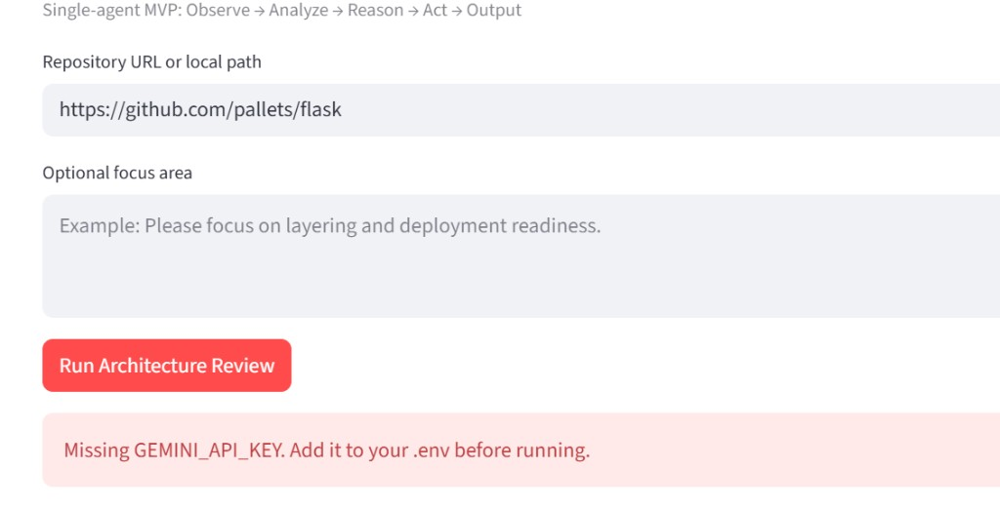
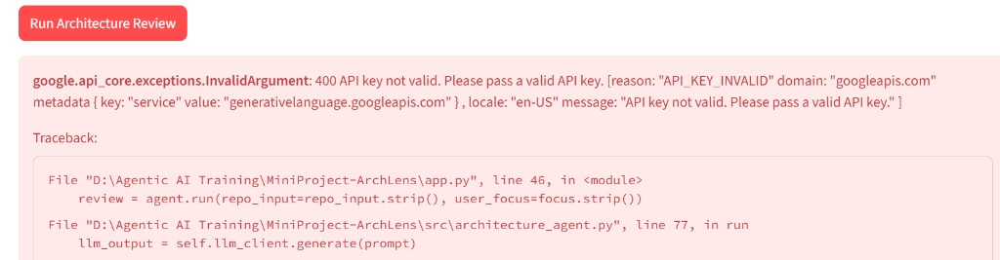
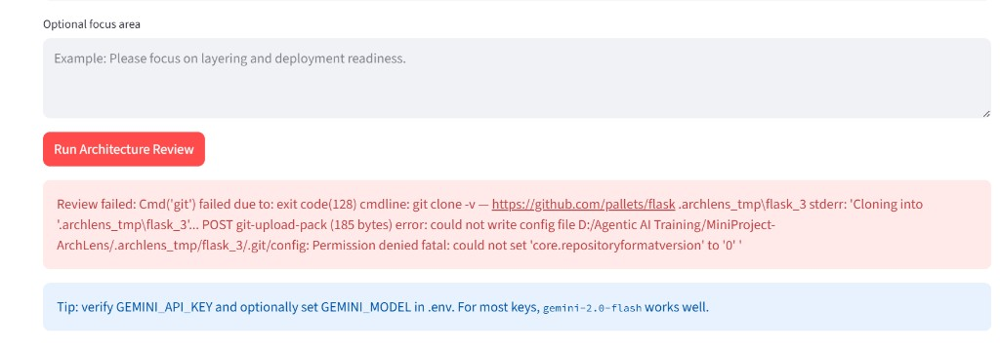
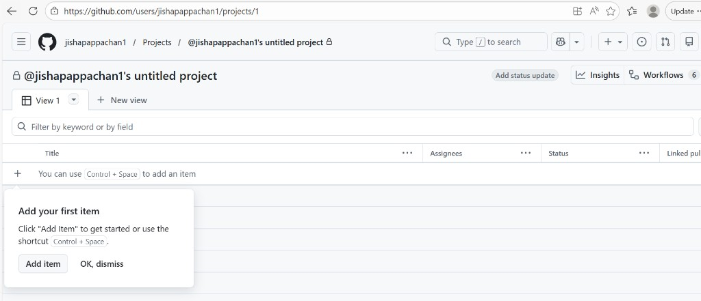
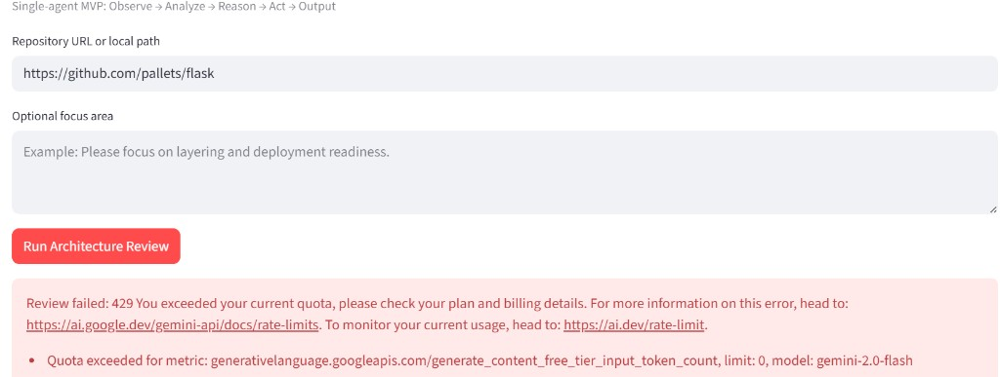

# ArchLens Demo Runbook

## 1. Demo Objective

Demonstrate a complete single-agent architecture review workflow:
Observe -> Analyze -> Reason -> Act -> Output.

## 2. Demo Duration

- Recommended: 10-15 minutes

## 3. Prerequisites

- Python environment with dependencies installed.
- Streamlit app running:
  - `streamlit run app.py`
- Internet access for GitHub repo ingestion.

## 4. Demo Script (Presenter Steps)

### Step 1: Introduce Problem (1 minute)
- Teams need fast architecture-level insight before deep code review.
- ArchLens gives lightweight, explainable architecture feedback.

### Step 2: Show UI Entry (1 minute)
- Open Streamlit app.
- Highlight repository input and optional focus.

### Step 3: Run Review (2-3 minutes)
- Input sample repo URL (e.g., `https://github.com/pallets/flask`).
- Click **Run Architecture Review**.
- Mention backend stages:
  - ingestion
  - deterministic analysis
  - LLM reasoning/fallback
  - report generation

### Step 4: Explain Output Sections (3-4 minutes)
- Architecture Overview
- Strengths
- Risks / Smells
- Recommendations
- Confidence Note

### Step 5: Show Downloaded Markdown (1 minute)
- Use **Download Markdown Report**.
- Mention this is shareable with architects/team leads.

### Step 6: Explain Resilience (2 minutes)
- If Gemini quota is unavailable, app automatically uses mock-learning mode.
- This keeps demo and training flow unblocked.

## 5. Suggested Talking Points

- Why deterministic preprocessing is important.
- Why single-agent design is easier for MVP and explainability.
- Why structured output schema improves consistency.
- Why fallback handling is required in real demos.

## 6. Q&A Prep

### Q: Is this deep static analysis?
A: No. It is repository-structure and metadata-based architecture reasoning.

### Q: Is output always accurate?
A: It is reasoning-oriented guidance, not formal correctness proof.

### Q: Why mock mode?
A: To preserve training/demo continuity when API quota is unavailable.

## 7. Screenshot Checklist (Add Before Final Presentation)

Store images under `docs/screenshots/` and keep these names:

1. `01_home_screen.png` - initial app with input fields
2. `02_run_in_progress.png` - spinner/state while review runs
3. `03_review_output.png` - completed report sections
4. `04_download_report.png` - markdown download/report saved confirmation
5. `05_quota_fallback_mock_mode.png` - warning + successful fallback scenario

Use these links in slides or docs:
- 
- 
- 
- 
- 
